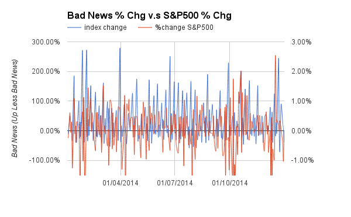
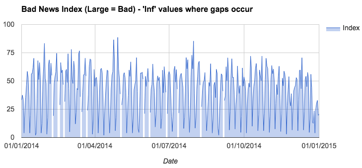
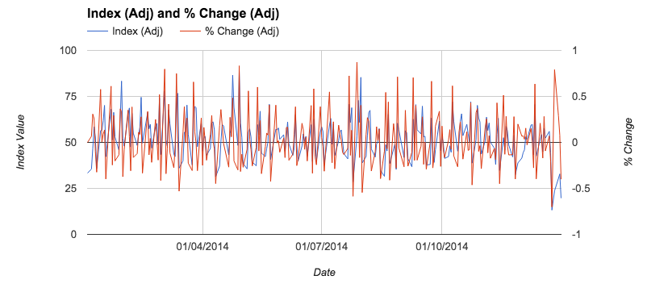
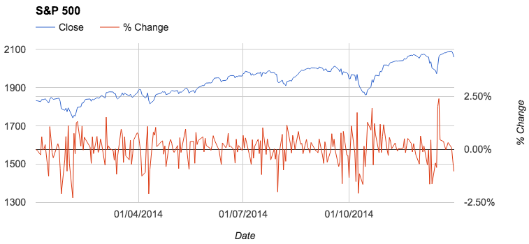
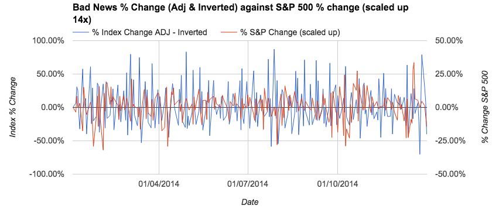
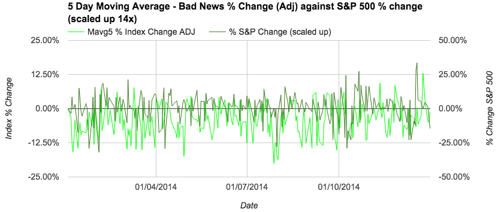

#The Financial Press and Stock Markets in Times of Crisis
###Whitepaper Experimentation - 27/08/15 - Marcus Williamson

Please find link to previous analysis piece [here](https://github.com/mw572/financial-markets/edit/master/Whitepaper%20Research/The%20financial%20press%20and%20stock%20markets%20in%20times%20of%20crisis/Whitepaper%20Analysis.md)

---

####Format:

1. Preparation
    1. Ideas & Objectives
    1. Pitfalls & Changes
    1. Resources needed
1. Construction
    1. Data collection
    1. Index creation
    1. Analysis of index
1. Conclusion
    1. Findings
    1. Notes

---

####1.1 Ideas and objectives

* Ideas:
    + Reproduce this for online news as physical copies are not obtainable
    + Take headlines hosted on site for each day, compiling news from previous 24 hours to trade with in the next trading session
    + Develop a bad news index like in the whitepaper
    + Collect news over 1 year from WSJ
* Objectives:
    + Collect data
    + Develop index
    + Investigate its signal generating properties

---

####1.2 Pitfalls & Challenges

* Data collection is difficult and scraping sometimes is prevented
* Optimal news sources cost
* Online news is different to printed newspapers with main columns
* Implied volatility is not technically enough of a signal to utilise in an algorithm
* Search term was needed, this was chosen as “Market” as it encapsulates all headlines who’s content could be tagged as being related in a direct or more indirect sense (e.g company within the market vs actually discussing the market)
* We do not have front page of newspaper to see how columns are priorities for front page news so news released over a 24 hour period will define one large front page by experimental design. This is not optimal but time constraints are in place
* Bad word dictionary used does not contain market specific words, such as “recession” 

---

####1.3 Resources needed

1. News data
1. Market data
1. Script to scrape news data
1. Script to generate signal from the noises

---

####2.1 Data Collection

**Scraping WSJ Headlines**

Wall Street Journal was visited  and a search initiated for “market” between year beginning 2014 to year beginning 2015, URL data was extracted looking at the structure.

In R: a script ([newsdatacollection.R](https://github.com/mw572/financial-markets/blob/master/Whitepaper%20Research/The%20financial%20press%20and%20stock%20markets%20in%20times%20of%20crisis/Scripts/newsdatacollection.R)) was written to extract the dates and corresponding headline from the page of search results, a function was a utilised to iterate through all the available pages. The data was this is compiled together into a data frame which is saved as a Rdata file ([WSJ-14-15-Backup.Rdata](https://github.com/mw572/financial-markets/blob/master/Whitepaper%20Research/The%20financial%20press%20and%20stock%20markets%20in%20times%20of%20crisis/Data/R%20Backup/WSJ-14-15-Backup.Rdata)) which will be utilised in the next step on calculating the bad news index. A CSV file was also saved incase of needed to manipulate the raw data or review it at a later date.

**Market data collection**

S&P 500 daily close data was obtained via the Google Sheets - Google Finance API via the function: "=googlefinance(“SPX”,”PRICE”,”2014-01-01”,”2015-01-01”,”DAILY)"

---

####2.2 Index creation

**The 'Bad News Index'**

From the paper we can extract the following principles of the bad news index that may be of use:
1. Number of negative banner headlines out of availble columns = daily number of bad news headlines out of total market headlines that day
1. Counting the ratio of negative words over total words
1. Relative importance index = negatives headlines / total headlines

**Bad news index = relative importance * (Total headlines * (1+Negative word ratio))**

We are aware at this point that there may be the case of no negative headlines as determined by the word dictionary in a day, where this result would not be valid and should be zero.

**Negative Word Dictionary**

Obtaining a negative word dictionary will be required, this itself is quite contradictory as double negatives are positives, and we are not delving into the rigours of NLP to understand language structure. However due to the brevity of headlines (and the well known skew implied from the paper and general knowledge of media’s negativity) this should be less of an issue. I make the assumption that brief headlines are less likely to use double negatives, rather,  plain english with sensationalistic words.  

A suitable code [repository](https://github.com/abromberg/sentiment_analysis) has been cloned from github where this ‘bad word counting’ style of sentiment analysis has been performed in R. This was used as inspiration to my approach. 

**Creating the index**

In R: a script ([newsindexcreator.R](https://github.com/mw572/financial-markets/blob/master/Whitepaper%20Research/The%20financial%20press%20and%20stock%20markets%20in%20times%20of%20crisis/Scripts/newsindexcreator.R)) was created, this loaded up the bad word dictionary and the scraped Rdata that was previously saved. The script makes comparisons between the dictionary and the headlines broken into cleaned individual words, counting the occurrences. The raw counts for each headline were flattened into day intervals (of the constituent headlines). From the daily counts the BNI (Bad New Index) was calculated for each day, “Inf” values were generated for lines where there was only positive news, these are later replaced with “0” to represent a low score on the BNI. The script exports the data in CSV format.

**Initial results**
 
An Initial preview glance at results can be seen below, considering the lack of data, and relatively unspecific and non financial nature of bad words looked for. Note we are lagging the bad news index so that it is 24 hours behind its release to make it accurate. Here we are looking at the index the wrong way up, it should be inverted to show a fall in bad news change as (ideally) as positive change in the market.

**Refining the original bad word dictionary**

I began looking into a more improved bad news word dictionary, one which captured the essence of negative financial news reporting. I did this by searching over a recessionary period for the most common non-stop-word / non-entity used to frame the current status of the economy.

Using the dates found on FRED Economic research for [US Recessions](https://research.stlouisfed.org/fred2/series/USREC), the dates 1st December 2007 - 1st July 2009 are highlighted as the most recent recession. Using the script that was used to scrape the WSJ headlines, I scraped the headlines from this time period again from the WSJ with search term market to begin modelling the words used in this time of crisis. The output was saved as an Rdata file ([WSJ-08-Recession-Backup.Rdata](https://github.com/mw572/financial-markets/blob/master/Whitepaper%20Research/The%20financial%20press%20and%20stock%20markets%20in%20times%20of%20crisis/Data/R%20Backup/WSJ-08-Recession-Backup.Rdata)) and CSV output ([WSJ-08-Recession-Market.csv](https://github.com/mw572/financial-markets/blob/master/Whitepaper%20Research/The%20financial%20press%20and%20stock%20markets%20in%20times%20of%20crisis/Data/CSV's/WSJ-08-Recession-Market.csv)).

Once all the words were extracted, I did this by interrupting parts of the script so that words were split and regularised then forcing it to output that current data. I used Google Sheets to render all the headlines into a single list of words with repeats. This was put into a word counter and then reviewed: I extracted the most used words over this reporting period that were not stop words or entities, this was done by manual means with a total selection of  65 unique words. This was not done with a more controlled nature due to time limitations. The results of this can be found [here](https://goo.gl/M96t3J)

---

####2.3 Analysis of Index

**Output from the script**

The index output from the BNI creation script (with the improved bad word dictionary) was saved as a CSV file ([WSJ-2014-15-Market-index.csv](https://github.com/mw572/financial-markets/blob/master/Whitepaper%20Research/The%20financial%20press%20and%20stock%20markets%20in%20times%20of%20crisis/Data/CSV's/WSJ-2014-15-Market-index.csv)), the corresponding counts were saved as ([WSJ-2014-15-Market-counts.csv](https://github.com/mw572/financial-markets/blob/master/Whitepaper%20Research/The%20financial%20press%20and%20stock%20markets%20in%20times%20of%20crisis/Data/CSV's/WSJ-2014-15-Market-counts.csv)) although these are not used in the next piece of analysis.

**Importing to Google Sheets**

Having now imported the index CSV data into Google Sheets, the following manipulations are performed in [this sheet](https://goo.gl/zhRmFu), with corresponding tab number:

1. **RAW Import**
    1. Replace ’Inf’ Values with 0
    1. __The data will be offset by 1 day on moving to the next sheet__, so yesterdays news is tradable today as opposed to the day before (collection day is different to actionable trade day)
    

1. **Adjusted - Trading Days**
    1. Data is collapsed into trading days only, so data that was released over the weekend / bank holiday is available on the next market day, the index is averaged over these days a means of providing a more balanced outlook. This has also inadvertently removed all zero values from the bad news index.
    1. Initial plotting and heat mapping shows somewhat of an autocorrelation that I may decide to analyse in R later
    
    
    
1. **S&P500**
    1.Market index data is imported and % change calculated
    
    
    
1. **Index & S&P500**
    1. The bad news index % change is inverted so to reflect a raise in the index % change corresponding to a fall in bad news, this is plotted against the % change of the S&P 500, which has has its % change scaled up by a factor of 14, as this was roughly the average difference between the average term in sizing (this manipulation is purely for visualisation purposes).
    
    
    
1. **Smoothed Index & S&P500**
    1. Smoothing the BNI as to have a clearer view of potential signal amongst the noise, it is not looking promising, however there may be need to examine what mavg is suitable and if establish if we are looking at daily fluctuations or unusual events.
    1. Just as a quick trial and error modification, I tried inverting the BNI % change just to see if this looked more suitable. Considering the potential dynamic of mean reversion from bad headlines (bad headline on day x causes -ve index move on day x, however +ve reversion on day x+1, sort of principle) the results look as follows. 

---

####3.1 Findings

---

####3.2 Notes

---

**This will need testing for statistical significance or display of any predictive power, the index and how its influence (correlation/causation) is reflective on market returns will have to be testing and modified. **

**This is a work in progress!**
